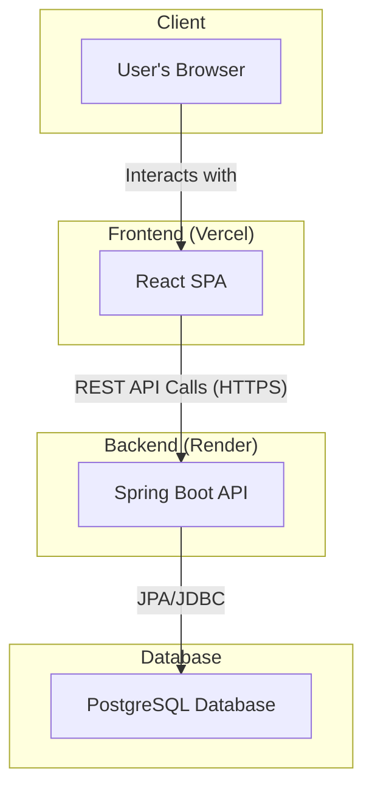

# 🎁 GiftRSVP: Smart RSVP & Gift Coordination

GiftRSVP is a full-stack web application designed to streamline event organization and gift coordination. It provides a simple solution for event hosts to create RSVP links and for guests to register their attendance and the gift they plan to bring. The core functionality prevents duplicate gifts, ensuring every present is unique, and provides a smooth experience for both hosts and attendees.

## ✨ Features

-   **Event Creation**: Organizers can create events and generate a unique RSVP link.
-   **Gift Reservation**: Attendees can submit the gift they plan to bring through a simple form.
-   **Duplicate Gift Alerts**: The system provides real-time feedback, alerting a user if their chosen gift has already been reserved by another attendee for the same event.
-   **Attendee Counting**: Tracks the number of guests attending an event.
-   **User-Friendly Interface**: A simple and clean UI with a modern, purple-themed design.

## 🏛️ High-Level Architecture

The application follows a classic client-server architecture. The frontend is a single-page application built with React, which communicates with a Java Spring Boot backend via a REST API. The backend handles business logic and persists data in a relational database.



## 🛠️ Technology Stack

| Component | Technology                                                                          |
| :-------- | :---------------------------------------------------------------------------------- |
| **Backend**     | Java, Spring Boot, Spring Data JPA, Maven/Gradle                                    |
| **Frontend**    | React, Vite, JavaScript, Tailwind CSS                                               |
| **Database**    | PostgreSQL (or any JPA-compatible relational database)                              |
| **Deployment**  | Frontend on [Vercel](https://vercel.com/), Backend on [Render](https://render.com/) |

## 📁 Module Breakdown

This section provides a detailed overview of the key files and directories in the project.

### Backend (`com.RSVP.RSVP_Back`)

The backend is a monolithic Spring Boot application responsible for handling API requests, business logic, and database interactions.

| File Path                               | Description                                                                                                                                                                                                                           |
| :-------------------------------------- | :------------------------------------------------------------------------------------------------------------------------------------------------------------------------------------------------------------------------------------ |
| `RsvpBackApplication.java`              | The main entry point for the Spring Boot application. It contains the `main` method which bootstraps the entire backend service.                                                                                                        |
| `model/Attendee.java`                   | A JPA entity class that maps to the `attendees` table in the database. It defines the structure of an attendee's record, including `eventId`, `attendeeName`, `numOfAttendees`, and the `gift`.                                           |
| `repository/AttendeeRepository.java`    | A Spring Data JPA repository interface for `Attendee` entities. It provides standard CRUD operations and includes custom query methods like `existsByEventIdAndGift()` for checking gift uniqueness and `countByEventId()` for counting attendees. |
| `service/AttendeeService.java`          | The service layer that encapsulates the core business logic. It interacts with the `AttendeeRepository` to perform operations such as checking if a gift is unique, registering a new attendee, and getting the total attendee count. |
| `controller/AttendeeController.java`    | The REST controller that exposes API endpoints to the frontend. It handles incoming HTTP requests, calls the appropriate service methods, and returns HTTP responses. It includes endpoints for registering attendees and checking gifts. |

### Frontend (Client)

The frontend is a modern React application built with Vite and styled with Tailwind CSS.

| File Path           | Description                                                                                                                                                                                                                                            |
| :------------------ | :----------------------------------------------------------------------------------------------------------------------------------------------------------------------------------------------------------------------------------------------------- |
| `index.html`        | The main HTML file and entry point for the React application. The browser loads this file, which in turn loads the JavaScript bundle containing the React app. The `<div id="root"></div>` is where the React application is mounted.                    |
| `eventApi.js`       | A dedicated JavaScript module for handling all API communication with the backend. It centralizes `fetch` calls, making it easy to manage API endpoints and requests like `checkGiftUniqueness` and `submitAttendee`.                                     |
| `vite.config.js`    | The configuration file for Vite, the frontend build tool. It specifies project plugins, such as `@vitejs/plugin-react` for React support and `@tailwindcss/vite` for Tailwind CSS integration.                                                             |
| `index.css`         | The global stylesheet for the application. It imports Tailwind CSS and defines global styles for elements like `body`, headings, buttons, and links, establishing the purple color theme and overall design language.                                        |
| `App.css`           | A component-level or legacy CSS file. It contains styles specific to certain components or initial project styles before the full adoption of Tailwind CSS.                                                                                              |
| `eslint.config.js`  | The configuration file for ESLint. It defines linting rules to enforce code quality, consistency, and best practices across the JavaScript/React codebase.                                                                                               |

## 📝 API Endpoints

The backend exposes the following REST API endpoints. All endpoints are prefixed with `/api/events`.

| Method | Endpoint                                        | Description                                                                 | Request Body                                                                      | Success Response                                      |
| :----- | :---------------------------------------------- | :-------------------------------------------------------------------------- | :-------------------------------------------------------------------------------- | :---------------------------------------------------- |
| `GET`  | `/{eventId}/attendees/check-gift?gift={giftName}` | Checks if a specific gift has already been taken for a given event.         | N/A                                                                               | `200 OK` with JSON `{"isUnique": true/false}`         |
| `POST` | `/{eventId}/attendees`                          | Registers a new attendee and their gift for an event.                       | JSON object: <br>`{ "attendeeName": "string", "numOfAttendees": number, "gift": "string" }` | `200 OK` with message "RSVP submitted successfully!"  |
| `GET`  | `/{eventId}/attendees/count`                    | Gets the total number of registered attendees for a specific event.         | N/A                                                                               | `200 OK` with an integer representing the total count |

## 🚀 Getting Started

Follow these instructions to set up and run the project locally.

### Prerequisites

-   **Java Development Kit (JDK)**: Version 17 or later.
-   **Maven** or **Gradle**: For building the backend.
-   **Node.js and npm**: Version 18 or later.
-   **PostgreSQL**: Or another relational database.

### Backend Setup

1.  **Clone the repository:**
    ```bash
    git clone https://github.com/your-username/GiftRSVP.git
    cd GiftRSVP # Navigate to the backend root directory
    ```

2.  **Configure the database:**
    -   Create a new PostgreSQL database.
    -   Rename `src/main/resources/application.properties.example` to `application.properties`.
    -   Update `application.properties` with your database URL, username, and password:
        ```properties
        spring.datasource.url=jdbc:postgresql://localhost:5432/your_db_name
        spring.datasource.username=your_db_username
        spring.datasource.password=your_db_password
        spring.jpa.hibernate.ddl-auto=update
        ```

3.  **Build and run the application:**
    ```bash
    # Using Maven
    ./mvnw spring-boot:run

    # Using Gradle
    ./gradlew bootRun
    ```
    The backend server will start on `http://localhost:8080`.

### Frontend Setup

1.  **Navigate to the frontend directory:**
    Assuming your frontend code is in a `frontend` sub-directory (adjust if needed).
    ```bash
    cd frontend
    ```

2.  **Install dependencies:**
    ```bash
    npm install
    ```

3.  **Configure API URL:**
    -   Open `eventApi.js`.
    -   Change the `BASE_URL` to point to your local backend server:
        ```javascript
        const BASE_URL = "http://localhost:8080/api/events";
        ```

4.  **Run the development server:**
    ```bash
    npm run dev
    ```
    The frontend will be available at `http://localhost:5173` (or another port specified by Vite).

## ⚙️ Configuration

-   **Backend Port**: The default port is `8080`. This can be changed in `src/main/resources/application.properties` by adding `server.port=NEW_PORT`.
-   **CORS Policy**: The Cross-Origin Resource Sharing (CORS) policy is configured in `AttendeeController.java` with the `@CrossOrigin` annotation. For local development, you might need to add your frontend's origin (e.g., `"http://localhost:5173"`) to the list.
-   **Frontend API URL**: The backend API endpoint is hardcoded in `eventApi.js`. For production builds, this should be updated to the deployed backend URL.

## 🎬 Demo

For a visual walkthrough of the application, please see the demo video:

[Watch Demo on Google Drive](https://drive.google.com/file/d/17Kh32bk6CzsTFQbtRVMwDzwoNjH6i0MU/view?usp=sharing)
